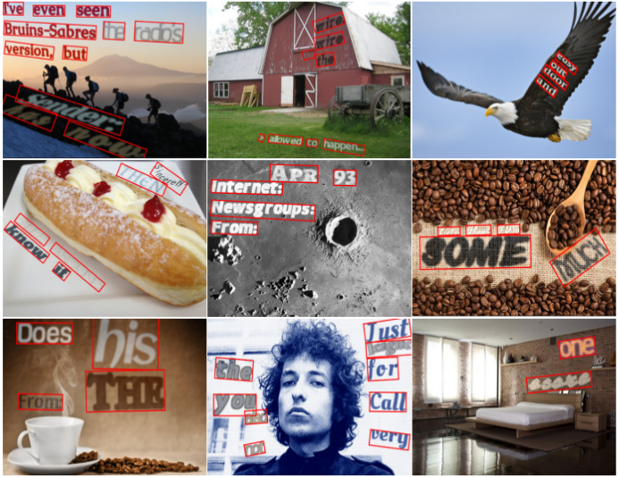

# 具体使用说明详见[CSDN BLOG](https://blog.csdn.net/yshtjdx/article/details/112425866)

## SynthText官方示例生成效果

https://github.com/ankush-me/SynthText

直接下载工程，和工程开源的SynthText.h5等数据，直接python gen.py即可。


**我这里使用的是工程中的python3分支**

## Adding New Images

Segmentation and depth-maps are required to use new images as background. Sample scripts for obtaining these are available [here](https://github.com/ankush-me/SynthText/tree/master/prep_scripts).

- `predict_depth.m` MATLAB script to regress a depth mask for a given RGB image; uses the network of [Liu etal.](https://bitbucket.org/fayao/dcnf-fcsp/) However, more recent works (e.g., [this](https://github.com/iro-cp/FCRN-DepthPrediction)) might give better results.
- `run_ucm.m` and `floodFill.py` for getting segmentation masks using [gPb-UCM](https://github.com/jponttuset/mcg).

For an explanation of the fields in `dset.h5` (e.g.: `seg`,`area`,`label`), please check this [comment](https://github.com/ankush-me/SynthText/issues/5#issuecomment-274490044).

要想使用自己的bg数据，需要先得到depth和seg, 然后合并成dset.h5文件，之后调用SynthText中的gen.py生成数据；

### 生成depth

https://bitbucket.org/fayao/dcnf-fcsp/src/master/

我这里使用的自己的window10的笔记本电脑中的matlab环境(Matlab2016b)

使用改代码时，需要在libs下MatConvNet和VLFeat，虽然原工程已经配置了这两个，但是matconvnet_20141015需要换成matconvnet-1.0-beta9版本(下载地址：https://www.vlfeat.org/matconvnet/download/)，不然程序运行时会报错, VLFeat不用修改；同时修改./demo/demo_DCNF_FCSP_depths_prediction.m中的相关部分(P15-23行)如下：

```
function demo_DCNF_FCSP_depths_prediction(varargin)


run( '../libs/vlfeat-0.9.18/toolbox/vl_setup');

% dir_matConvNet='../libs/matconvnet_20141015/matlab/';
dir_matConvNet='../libs/matconvnet-1.0-beta9/matconvnet-1.0-beta9/matlab/';
addpath(genpath(dir_matConvNet));
run([dir_matConvNet 'vl_setupnn.m']);
```

注意重新编译matconvert-1.0-beta9版式时，参考https://www.vlfeat.org/matconvnet/install/中的说明，我这里是直接编译的CPU版本；具体步骤如下，因为我的matlab一开始没有装C++的编译器，所以需要配置VS2015的C++编译器给matlab(https://blog.csdn.net/qq_17783559/article/details/82017379)，然后mex -setup C++才能成功。


编译成功后，使用**dcnf-fcsp/src/master/demo/demo_DCNF_FCSP_depths_prediction.m**或者**SynthText/prep_scripts/predict_depth.m**生成自己准备的bg图片的depth.mat文件，我是准备了12张example，每一个example对应一个文件夹，最终生成的效果是每一个文件夹下有一张rgb原始图片，生成一张gray灰度图片和一份depth.mat文件。


将这12个文件夹放到服务器上，运行convert_depth_mat_to_h5.py程序，得到depth.h5文件。

```
##convert_depth_mat_to_h5.py
import os
import h5py
import glob

def convert_mat_to_h5(mat_path, h5_output_path):

    data_w=h5py.File(h5_output_path,'w')
    for sample in glob.glob(path):
        print('sample:',sample)
        imname = sample.split('/')[-2] + '.jpg'
        data=h5py.File(sample,'r')
        data_w.create_dataset(imname, data=data['data_obj'][:])
    data_w.close()

if __name__=='__main__':
    path = r'/data/nfs/yangsuhui/SynthText/prep_scripts/new_own_image_material/results_three/custom_outdoor_sample/*/*.mat'
    output_path = r'/data/nfs/yangsuhui/SynthText/prep_scripts/new_own_image_material/depth.h5'
    convert_mat_to_h5(path,output_path)

```

### 生成seg

https://github.com/jponttuset/mcg

该程序只能运行在linux环境下，因此我在ubuntu16.04的环境下安装了matlab R2016b，然后使用**SynthText/prep_scripts/run_ucm.m**，如下图所示，修改代码中的img_dir和mcg_dir路径即可，得到指定路径下的

ucm.mat文件，然后运行**SynthText/prep_scripts/floodFill.py**，修改**floodFill.py**程序中的base_dir为第一步生成的ucm.mat文件路径，得到最终的**seg_uint16.h5**文件。


### 合并depth和seg等文件成统一的dest.h5

运行程序[add_more_data.py](https://github.com/JarveeLee/SynthText_Chinese_version/blob/master/add_more_data.py)，借鉴[use_preproc_bg.py](https://github.com/ankush-me/SynthText/blob/master/use_preproc_bg.py)写法)，用于将1、2步生成的depth和seg和原图组合成同一个dset文件。

```
##add_more_data.py
import numpy as np
import h5py
import os, sys, traceback
import os.path as osp
import wget, tarfile
import cv2
from PIL import Image


def add_more_data_into_dset(DB_FNAME,more_img_file_path,more_depth_path,more_seg_path):
  db=h5py.File(DB_FNAME,'w')
  #depth_db=get_data(more_depth_path)
  depth_db=h5py.File(more_depth_path,'r')
  #seg_db=get_data(more_seg_path)
  seg_db=h5py.File(more_seg_path,'r')
  db.create_group('image')
  db.create_group('depth')
  db.create_group('seg')
  for imname in os.listdir(more_img_file_path):
    if imname.endswith('.jpg'):
      full_path=more_img_file_path+imname
      print(full_path,imname)

      # j=Image.open(full_path)
      # imgSize=j.size
      # rawData=j.tostring()
      # img=Image.fromstring('RGB',imgSize,rawData)
      img = cv2.imread(full_path)
      img = img[...,::-1]
      #img = img.astype('uint16')
      db['image'].create_dataset(imname,data=img)
      db['depth'].create_dataset(imname,data=depth_db[imname])
      db['seg'].create_dataset(imname,data=seg_db['mask'][imname])
      db['seg'][imname].attrs['area']=seg_db['mask'][imname].attrs['area']
      db['seg'][imname].attrs['label']=seg_db['mask'][imname].attrs['label']
  db.close()
  depth_db.close()
  seg_db.close()
# path to the data-file, containing image, depth and segmentation:
DB_FNAME = '/data/nfs/yangsuhui/SynthText/prep_scripts/new_own_image_material/dset_own_12.h5'

#add more data into the dset
more_depth_path='/data/nfs/yangsuhui/SynthText/prep_scripts/new_own_image_material/depth.h5'
more_seg_path='/data/nfs/yangsuhui/SynthText/prep_scripts/new_own_image_material/seg_uint16.h5'
more_img_file_path='/data/nfs/yangsuhui/SynthText/prep_scripts/new_own_image_material/bg_imgs/'

add_more_data_into_dset(DB_FNAME,more_img_file_path,more_depth_path,more_seg_path)

```

### 生成数据

根据自己数据生成的dset_own_12.h5文件，运行gen.py(修改DB_FNAME = osp.join(DATA_PATH,'dset.h5')为自己的dset文件)，即可生成自己数据背景下的生成数据。

运行gen.py，终端显示(有些bg图片计算过程中会出现一些错误，比如下面的0 of 11，这表明有些图片做bg不太合适，最终生成的是10张图片(去掉背景错误生成不了的)，10中背景，不同背景只生成一张，通过gen.py中的超参数设置(INSTANCE_PER_IMAGE))：


运行visualize_results.py可以查看SynthText.h5文件生成的效果，并保存图片，运行效果如下，运行一张图片，并弹出图片窗口，终端是显示图片名称和生成的图片中的words和chars个数以及生成的文本text，最终的图片上可以控制显示charBB(字符级别的框)和wordBB(单词级别)。


下图中除了第一张是用的官方的SynthText.h5生成的，其余的都是自己的bg图片生成的效果。


### 垂直文本的生成

参考https://github.com/ankush-me/SynthText/issues/114, 修改text_utils.py文件下的相应函数(render_multiline)即可，效果如下：


## 注意事项

1、该程序的visualize_results.py利用matplotlib可以将远程的SynthText.h5中的生成的内容显示出来，用pillow或者opencv很难将图像显示出来在MobaxTerm上；

2、步骤1和2中的depth.mat和ucm.mat文件转h5文件时，mat文件的读取有两种方式，尝试了scipy的io模块和h5py模块，其中如果保存的mat文件时用的matlab指定的-v7.3(如步骤2中run_ucm.py中最后一行save('ucm.mat','ucms','names','-v7.3');)，则scipy的io读取会报错，解决方法就是统一用h5py读取mat文件(参考[1](https://blog.csdn.net/Zhuanzhu22nian/article/details/89525762?utm_medium=distribute.pc_relevant.none-task-blog-BlogCommendFromBaidu-2.not_use_machine_learn_pai&depth_1-utm_source=distribute.pc_relevant.none-task-blog-BlogCommendFromBaidu-2.not_use_machine_learn_pai),[2](https://blog.csdn.net/wushaowu2014/article/details/80071238));有时候scipy的io模块导入不了，[解决方法](https://blog.csdn.net/qq_35860352/article/details/80209370)；


3、将多个图片拼成一张长图，我是用的是[pinthemall](https://pinthemall.net/)工具，当然还有许多其他好用的图像[拼接工具](https://zhuanlan.zhihu.com/p/50819697), 其中Shapecollage可以将图片拼成不同形状，甚至绘制自定义形状，而Collagelt则只能固定长方形(https://zhuanlan.zhihu.com/p/25151315)；


4、从代码和最后生成的效果上看，SynthText主要是根据depth图和seg图，主要将根据语料和文字频率生成的文字放到图片中的光滑区域，与实际场景图片中的文字出现的位置更加切合；

5、SynthText生成的框有char和word级别，没有sentence级别，因此如果是需要直接检测场景图片中的句子级别的(检测+识别)，该工程需要额外修改，或者应该使用其他的工程；

6、该工程生成数据的过程比较繁琐，而且速度比较慢;

7、修改后的[代码](https://github.com/yangsuhui/SynthText_Own)，因为自己生成的depth.h5中是单通道的，而官方的示例是多通道的，因此根据需要选择是否注释gen.py中112行(#depth = depth[:,:,1]   ##use own data to 注释这一行)。


## 原始SynthText的README
Code for generating synthetic text images as described in ["Synthetic Data for Text Localisation in Natural Images", Ankush Gupta, Andrea Vedaldi, Andrew Zisserman, CVPR 2016](http://www.robots.ox.ac.uk/~vgg/data/scenetext/).


**Synthetic Scene-Text Image Samples**


The code in the `master` branch is for Python2. Python3 is supported in the `python3` branch.

The main dependencies are:

```
pygame, opencv (cv2), PIL (Image), numpy, matplotlib, h5py, scipy
```

### Generating samples

```
python gen.py --viz
```

This will download a data file (~56M) to the `data` directory. This data file includes:

  - **dset.h5**: This is a sample h5 file which contains a set of 5 images along with their depth and segmentation information. Note, this is just given as an example; you are encouraged to add more images (along with their depth and segmentation information) to this database for your own use.
  - **data/fonts**: three sample fonts (add more fonts to this folder and then update `fonts/fontlist.txt` with their paths).
  - **data/newsgroup**: Text-source (from the News Group dataset). This can be subsituted with any text file. Look inside `text_utils.py` to see how the text inside this file is used by the renderer.
  - **data/models/colors_new.cp**: Color-model (foreground/background text color model), learnt from the IIIT-5K word dataset.
  - **data/models**: Other cPickle files (**char\_freq.cp**: frequency of each character in the text dataset; **font\_px2pt.cp**: conversion from pt to px for various fonts: If you add a new font, make sure that the corresponding model is present in this file, if not you can add it by adapting `invert_font_size.py`).

This script will generate random scene-text image samples and store them in an h5 file in `results/SynthText.h5`. If the `--viz` option is specified, the generated output will be visualized as the script is being run; omit the `--viz` option to turn-off the visualizations. If you want to visualize the results stored in  `results/SynthText.h5` later, run:

```
python visualize_results.py
```
### Pre-generated Dataset
A dataset with approximately 800000 synthetic scene-text images generated with this code can be found [here](http://www.robots.ox.ac.uk/~vgg/data/scenetext/).

### Adding New Images
Segmentation and depth-maps are required to use new images as background. Sample scripts for obtaining these are available [here](https://github.com/ankush-me/SynthText/tree/master/prep_scripts).

* `predict_depth.m` MATLAB script to regress a depth mask for a given RGB image; uses the network of [Liu etal.](https://bitbucket.org/fayao/dcnf-fcsp/) However, more recent works (e.g., [this](https://github.com/iro-cp/FCRN-DepthPrediction)) might give better results.
* `run_ucm.m` and `floodFill.py` for getting segmentation masks using [gPb-UCM](https://github.com/jponttuset/mcg).

For an explanation of the fields in `dset.h5` (e.g.: `seg`,`area`,`label`), please check this [comment](https://github.com/ankush-me/SynthText/issues/5#issuecomment-274490044).

### Pre-processed Background Images
The 8,000 background images used in the paper, along with their segmentation and depth masks, have been uploaded here:
`http://www.robots.ox.ac.uk/~vgg/data/scenetext/preproc/<filename>`, where, `<filename>` can be:

|    filenames    | size |                      description                     |             md5 hash             |
|:--------------- | ----:|:---------------------------------------------------- |:-------------------------------- |
| `imnames.cp`    | 180K | names of images which do not contain background text |                                  |
| `bg_img.tar.gz` | 8.9G | images (filter these using `imnames.cp`)             | 3eac26af5f731792c9d95838a23b5047 |
| `depth.h5`      |  15G | depth maps                                           | af97f6e6c9651af4efb7b1ff12a5dc1b |
| `seg.h5`        | 6.9G | segmentation maps                                    | 1605f6e629b2524a3902a5ea729e86b2 |

Note: due to large size, `depth.h5` is also available for download as 3-part split-files of 5G each.
These part files are named: `depth.h5-00, depth.h5-01, depth.h5-02`. Download using the path above, and put them together using `cat depth.h5-0* > depth.h5`.

[`use_preproc_bg.py`](https://github.com/ankush-me/SynthText/blob/master/use_preproc_bg.py) provides sample code for reading this data.

Note: I do not own the copyright to these images.

### Generating Samples with Text in non-Latin (English) Scripts
- @JarveeLee has modified the pipeline for generating samples with Chinese text [here](https://github.com/JarveeLee/SynthText_Chinese_version).
- @adavoudi has modified it for arabic/persian script, which flows from right-to-left [here](https://github.com/adavoudi/SynthText).
- @MichalBusta has adapted it for a number of languages (e.g. Bangla, Arabic, Chinese, Japanese, Korean) [here](https://github.com/MichalBusta/E2E-MLT).
- @gachiemchiep has adapted for Japanese [here](https://github.com/gachiemchiep/SynthText).
- @gungui98 has adapted for Vietnamese [here](https://github.com/gungui98/SynthText).
- @youngkyung has adapted for Korean [here](https://github.com/youngkyung/SynthText_kr).

### Further Information
Please refer to the paper for more information, or contact me (email address in the paper).
